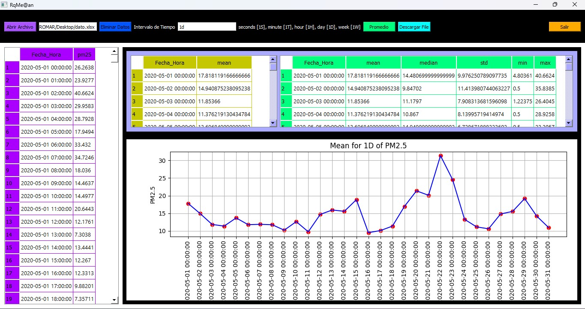

## Project RqMe@n
The software allows averaging by specified time interval of the administrative pollution data set, which will enable pollution specialists to perform pollution level analysis and studies.

### Software Operation:

The program prompts to load excel data to calculate averages by specified time interval.

The 'Open File' button is used to select and load the excel document.

With the button 'Delete Date' the invalid data are deleted.

In the time interval field we enter the specific time to group the data and calculate the average.

With the button 'Average' we will calculate the averages of the loaded data grouping by time interval, the time interval will be obtained from the text field.

With the button 'Download File' will request where you want to download the excel file of the averages calculated by the specified time.

Finally, the 'Exit' button allows you to close the program.

## File executable
The file QqMe@n.exe is the project executable.

